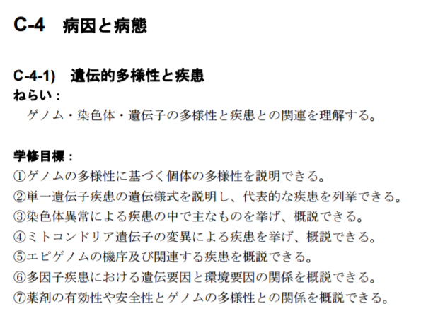

# Basics

### Skills of answering questions ~ Brief description and definition

Check "what definition is" and "how to write definition" if you are not familiar with definition.

What definitin is : https://en.wikipedia.org/wiki/Definition 

How to write definition : https://en.wikipedia.org/wiki/Wikipedia:Writing_better_articles/Define_and_describe 

「定義とは」「定義の仕方」を確認すること。

定義とは：https://ja.wikipedia.org/wiki/定義

定義の仕方：https://ja.wikipedia.org/wiki/Wikipedia:定義と記述

## Terms of statistical genetics and basics of R and statistics

### EdX Mooc

Take the section 1 of the EdX Mocc course "Introduction to Statistical Methods of Gene Mapping." 

https://www.edx.org/course/introduction-statistical-methods-gene-kyotoux-005x 

### Check your knowledge on genetics and genetic heterogenetity

医学科卒業時に必要な知識を以下に示す。講義開始にあたり、自身の知識を確認し、各項目につき短文で説明できるようにせよ。



C-4 Disease pathology and clinical features

C-4-1 Genetic diversity and diseases

aim) Understand the relationship between diversity in genome,  chromosome, and genes and diseases


Study goals are to;

1: be able to describe individual diversity based on genetic diversity

2: be able to describe genetic modes of monogenic disorders and to make a list of representative monogenic disorders

3: be able to cite an example of chromosomal abnormalities and to outline it

4: be able to cite an example of diseases due to mutations of mitochondial genes and to outline it

5: be able to outline epigenomic mechanism of epigenome and its relating disorder

6: be able to outline relation between genetic factors and environmental factors in multifactorial disorders


E Systemic physiological changes, clinical features, diagnosis, and treatments 

E-1-1   Genetic medical service, genome medicine and the characteristics of their information

aim) understand the characteristics of genetic and genome information and study diagnosis and treatment of the patients and supports of preclinical individuals and their family based on genetic and genome information.

## No background on molecular genetics?

現在やっている講義内容よりもウェット寄りの基礎事項を確認したい人は、学部１回生向けの分子遺伝学テキストのドラフトをアップしました(こちら)ので使ってください

Sorry for Japanese only. If you think more wetty contents are useful for your progress in statistical genetics, a draft version of text of "molecular genetics" for 1st grade undergraduate might be helpful. The draft is @ http://statgenet-kyotouniv.wikidot.com/bunsiidengaku2017 .


# Mendelian traits

## Pedigree

Are you new to "R"? -> Go through "Basics of R".
In Japanese http://www.slideshare.net/m884/japan-r-15432969 
In English http://www.cyclismo.org/tutorial/R/ 

Draw a trio of parents and a male offspring. Mother and the child are affected.

ID

1 : father

2 : mother

3 : male offspring

sex

1 : male

2 : female

affected

0 : non-affected

1 : affected

```{r}
#install.packages("kinship2")
library(kinship2)
id  <- c(1, 2, 3)
mom <- c(0, 0, 2)
dad <- c(0, 0, 1)
sex <- c(1, 2, 1)
affected <- c(0,1,1)

ptemp<-pedigree(id=id,dadid=dad,momid=mom,sex=sex,affected=affected)
plot(ptemp)
```

```{}
[Exercise]
Make vectors of id, mom, dad, sex for a family with 10 or more members and 3 or more generations.
Draw a pedigree manually on a sheet of paper, then make vectors.

ex. 
id <- 1:11
mom <- c(0,0,2,2,0,0,5,5,6,6,6)
dad <- c(0,0,1,1,0,0,4,4,7,7,7)
sex <- c(1,2,1,1,2,2,1,2,2,1,2)
affected <- sample(0:1,11,replace=TRUE)
print(affected)
ptemp<-pedigree(id=id,dadid=dad,momid=mom,sex=sex,affected=affected)

plot(ptemp)
```

## Genotypes and phenotypes of mendelian traits

### Genotypes
"00", "01", and "11".

0 : "00"

0.5 : "01"

1 : "11"

Assign genotypes to the pedigree memebers.
You can assign genotypes to the members without paretns.
You can assign genotypes to the members with parents with restriction.

```{r}
gen <- c(1,0,0.5)
```

### Phenotypes (non-affected/affected)

"0" and "1".

### Genetic models

Dominant model means

$$
phenotype \ = 0 \ when \ genotype \ = 0 \\
phenotype \ = 1 \ when \ genotype \ = \ 0.5 \ or \  1
$$

```{r}
my.dom <- function(g){
  ph <- rep(0,length(g))
  for(i in 1:length(g)){
    if(g[i]>0){
      ph[i] <- 1
    }
  }
  return(ph)
}
my.dom(gen)
```
```{r}
affected <- my.dom(gen)
ptemp<-pedigree(id=id,dadid=dad,momid=mom,sex=sex,affected=affected)
plot(ptemp)
```

```{}
[Exercise]
Make a function, my.rec(), that returns phenotype in recessive model.
```


```{r, echo=FALSE}
my.rec <- function(g){
  ph <- rep(0,length(g))
  for(i in 1:length(g)){
    if(g[i]==1){
      ph[i] <- 1
    }
  }
  return(ph)
}
```

```{}
[Exercise]
Assigne genotypes (0,0.5,1) to the members of your pedigree with 10 or more members and 3 or more generations. Then calculate their phenotype in dominant and recessive models and draw pedigrees, respectively.

eg.
id <- 1:11
mom <- c(0,0,2,2,0,0,5,5,6,6,6)
dad <- c(0,0,1,1,0,0,4,4,7,7,7)
sex <- c(1,2,1,1,2,2,1,2,2,1,2)
gen <- c(0,1,0.5,0.5,1,0,1,0.5,0.5,0.5,0.5)
ph.dom <- my.dom(gen)
affected <- ph.dom
ptemp<-pedigree(id=id,dadid=dad,momid=mom,sex=sex,affected=affected)
plot(ptemp)

ph.rec <- my.rec(gen)
affected <- ph.rec
ptemp<-pedigree(id=id,dadid=dad,momid=mom,sex=sex,affected=affected)
plot(ptemp)
```

### Penetrance and phenocopy

Penetrance is the probability that phenotype "1" appears for people with corresponding genotype(s).

Probability to develop phenotype "1" is 0, penetrance, and penetrance for three genotypes 0, 0.5 and 1, respectively, when dominant.


```{r}
my.dom2 <- function(g,penet){
  ph <- rep(0,length(g))
  prob <- c(0,penet,penet)
  for(i in 1:length(g)){
    if(runif(1)<= prob[g[i]]){
      ph[i] <- 1
    }
  }
  return(ph)
}
```

```{}
[Exercise]
Answer probability to develope phenotype "1" for recessive model with penetrance.

Make a function, my.rec2(), for the case.
```
```{}
[Exercise]
- M is the responsible allele and m is not. Autosomal dominant trait with penetrance being 1 and no phenocopy. When paternal and maternal genotypes are Mm and Mm, respectively, answer the probability that their offspring's genotype is MM, Mm and mm, respectively. Answer the probability that their offspring develop the phenotype.

- The same setting with 1. When this couple plans to have four children without monozygotic multiple births, answer the expected number of offsprings with genotypes MM, Mm and mm, respectively. Answer the probability that 1 out of 4 offsprings has Mm genotype and the others have mm genotype.

-The same setting with 1. When this couple has a dizygotic twin, answer the probability that the twins genotypes are (MM,MM), (MM,Mm),(MM,mm),(Mm,Mm),(Mm,mm), and (mm,mm),respectively. Answer the probability that the number of affected offsprings is 0, 1 and 2, respectively.

-The same setting with 3 but, monozygotic twin rather than dizygotic. Answer similarly.

-The penetrance is now 0.6. Answer to the quiz 1 through 4.

###
Hints
g <- c("MM","Mm","mm")
trio.g <- expand.grid(g,g,g)

p <- rep(1,dim(trio.g)[1])

p <- p/sum(p)

# Modify p values based on info.
```

```{r, echo=FALSE}
my.rec2 <- function(g,penet){
  ph <- rep(0,length(g))
  prob <- c(0,0,penet)
  for(i in 1:length(g)){
    if(runif(1)<= prob[g[i]]){
      ph[i] <- 1
    }
  }
  return(ph)
}
```

Phenocopy is the probablity that phenotype "1" appears for people without corresponding genotype(s).

Probability to develop phenotype "1"is, phenocopy, 1, and 1 for three genetypes 0, 0.5 and 1, respectively, when dominant.

```{}
[Exercise]
Make a function, my.dom3(), that returns phenotype for dominant model with phenocopy.

Make a function, my.rec3(), that returns phenotype for recessive model with phenocopy.
```

```{r, echo=FALSE}
my.dom3 <- function(g,pheno){
  ph <- rep(0,length(g))
  prob <- c(pheno,1,1)
  for(i in 1:length(g)){
    if(runif(1)<= prob[g[i]]){
      ph[i] <- 1
    }
  }
  return(ph)  
}
my.rec3 <- function(g,pheno){
  ph <- rep(0,length(g))
  prob <- c(pheno,pheno,1)
  for(i in 1:length(g)){
    if(runif(1)<= prob[g[i]]){
      ph[i] <- 1
    }
  }
  return(ph)  
}
```
Phenotype developing probability vector for dominant model is

(pheno, penet, penet). The vector for recessive model is (pheno, pheno, penet).

```{}
[Exercise]

Make a function, my.dom4(), for dominant model reflecting phenocopy and penetrance.

Make a function, my.rec4(), for recessive model.
```

```{r,echo=FALSE}
my.dom4 <- function(g,penet,pheno){
  ph <- rep(0,length(g))
  prob <- c(pheno,penet,penet)
  for(i in 1:length(g)){
    if(runif(1)<= prob[g[i]]){
      ph[i] <- 1
    }
  }
  return(ph)  
}
my.rec4 <- function(g,penet,pheno){
  ph <- rep(0,length(g))
  prob <- c(pheno,pheno,penet)
  for(i in 1:length(g)){
    if(runif(1)<= prob[g[i]]){
      ph[i] <- 1
    }
  }
  return(ph)  
}
```

### Genotype-specific probability to develop phenotype "1"

Dominant and recessive models with penetrance and phenocopy specify phenotype developing probability vector.

(pheno, penet, penet)

(pheno, pheno, penet),

respectively.

We can make a function that takes the probability vecrot and returns phenotype.

```{r}
my.pheno <- function(g,prob){
  ph <- rep(0,length(g))
  #prob <- c(pheno,pheno,penet)
  for(i in 1:length(g)){
    if(runif(1)<= prob[g[i]]){
      ph[i] <- 1
    }
  }
  return(ph)    
}
```
```{}
[Exercise]
-３人の人がいる。常染色体座位の３つのジェノタイプ(MM,Mm,mm)を考え、3人のジェノタイプの組み合わせをすべて列挙せよ。すべての場合が等確率であると仮定したときの、それぞれの場合の確率も併せて答えよ。なお、何の情報も無い場合には、３ジェノタイプの確率は1/3ずつであるものとする。以下、同じ。Assume 3 persons. Assume an autosomal locus whose three genotypes are MM, Mm, and mm. Enumerate all combinations of genotypes of three persons. Assume all cases are equally likely and answer the probability of all cases. Assume three genotypes are equally likely otherwise specified, that is true for all Qs below.

-３人は両親と息子のトリオであるという。Q１の組み合わせにつき、トリオであるという情報に基づく、条件付確率を示せ。Assume they are a familial trio of father, mother and a son. Answer the conditional probability of all cases in Q1, conditioned the trio information.

-父親のフェノタイプが非発症、母親のフェノタイプが発症、息子のフェノタイプが発症であるようなトリオがある。常染色体性優性モデルを仮定しMM,Mmのジェノタイプの個人は必ず発症、mmジェノタイプでは必ず非発症とする。１で挙げた組み合わせのすべてにつき条件付確率を示せ。Assume father is unaffected and mother and son are affected. Assume autosomal dominant model, where individuals with MM or Mm affected 100% and individuals with mm are unaffected 100%. Answer the conditional probability of all cases in Q1.

-表現型は３と同じであり、常染色体性優性を仮定するが、３人は血縁関係がないとしたときの条件付確率を示せ。Same phenotypes with Q3 and assume AD but no blood relations among them. Answer the conditional probs.

-母子の関係のみがあり、父と思われた人は無関係だったとしたときを示せ。Assume mother-son relation is true but the 3rd person is not father and no relation. Answer the conditional prob.

-3-5について、常染色体劣性のモデルで計算せよ。Repeats Qs 3-5 for the assumption of autosomal recessive model.

-X染色体性優性のモデルではどうか？How about X-dominant?

##
Hints

-３ジェノタイプ別の確率が等しいという条件以外に情報がないとき。家族関係もないとき。すべての個人のジェノタイプ別確率は等しく、それは1/3ずつですから、３人のジェノタイプの三つ組みの確率はどれも等しく1/27です。With the condition that three genotypes are equally likely　and　no　other　information　and　no　relation　among　three　individuals,　genotype　freq　of　three　individuals are the same and 1/3each for three genotypes. Then, every trio of three genotypes for three individuals are equal and 1/27.

-血縁関係情報が与えられたとき、子のジェノタイプは親のジェノタイプに依存します。親のジェノタイプの条件付き分布になります。そのルールは先週の課題When blood relation information is given, offspring's genotype is conditional to parenで使ったルールです。ts' . Relation of genotypes of offspring and parents follows the rules that were used in the previous week's assingment.

-片親と子の親子関係はわかっていて、もう片方の親がわからなければ、不明親のジェノタイプは(1/3,1/3,1/3)と仮定して計算します。When relation between one parent and offspring is given but no info of the other parent, then the other parent's genotype should be assumed (1/3,1/3,1/3). 
```

```{}
[Exercise]
-Make  pedigree(s) of a trait described below. 以下に説明する形質の家系図を作れ

-Its responsible locus is in a autosomal chromosome. 常染色体にローカスがあり

-Its genotypic probability to develop the disease phenotype is 1,0.8,0.1 for MM, Mm and mm, respectively.３ジェノタイプのジェノタイプ別発症確率を1,0.8,0.1とする 

-How many members do you feel appropriate to make the pedigree(s) informative enough? 家系図(s)にどのくらいの人数を使うと、想定を説明できていると感じるか？

##
Hints

-In order to estimate probability to develop the disease phenotype of a particular genotype, you need some number of individuals who are supposed to have the particular genotype and then you can estimate the probability based on the number of white and black. 特定のジェノタイプの疾患表現型発現確率を推定するためには、そのジェノタイプを持つと思われる個人が一定数必要です。その個人の白・黒の内訳から発症率が推定されます。

-Unfortunately you can not tell genotype of members in the pedigree. Somebody's genotype should be estimated based on pedigree structure along with an prior assumption of genotype frequency in general. 残念ながら家系図メンバーのジェノタイプは隠されていますから、もし家系図がなかったらジェノタイプ頻度はいくつになるのか、という仮定の下で、家系図情報を加味し、各メンバーのジェノタイプ頻度を推定しないといけません。

-The assignment does not require the precise calculation of the estimation procedure, but it requires how you pick the scale of information that fits to the problem. そのような入れ子になった推定問題を正確に解くことが求められているわけではなく、スケールとしてどの程度の情報量が必要そうかを考えましょう。

-If you have good skills on simulation (with R), you may try to give reasonable answer based on your simulation and the attempt to write the codes for it might be a good excersise for you. Rとシミュレーションが得意な人は、シミュレーションベースでこの問いについて考えてみることも、勉強になるでしょう。
```


## NGS and Disease-responsible mutations

### Readings

#### NGS and genes related to diseases

Read the retivew below and grab the idea what UGS does for genetic disease studies
A review "Identifying Highly Penetrant Disease Causal Mutations Using Next Generation Sequencing: Guide to Whole Process".

https://www.hindawi.com/journals/bmri/2015/923491/


#### Basics to interpret functional significance of identified variants

https://www.ncbi.nlm.nih.gov/pubmed/16824020 

"Predicting the effects of amino acid substitutions on protein function." by Ng PC and Henikoff S.


http://www.acgs.uk.com/media/774853/evaluation_and_reporting_of_sequence_variants_bpgs_june_2013_-_finalpdf.pdf

"Practice Guidelines for the Evaluation of Pathogenicity and
the Reporting of Sequence Variants in Clinical Molecular
Genetics" by Yvonne Wallis et al.

```{}
[Exercise]
-以下の諸点を考慮し、どのようなバリアントがありえるかを出来る限り細かく分類列挙し、その重要性の順序を答えよ(複数のバリアントがあったときに、ただ１つのバリアントを選ぶことのみが許されると仮定して順序をつけよ)。Consider all the points below, classify single-nucleotide variant-type variants into as many types as possible. Assume you have to select only 1 variant among multiple variants regardless of uncertainty.

-たんぱく質コーディング遺伝子構造上にある一塩基置換型の遺伝子バリアントを考える。Consider single-nucleotide substitution-type genetic variants in a protein-coding gene.
構造上の位置、エクソン(5'UTR,3'UTR,non-UTR),イントロン(Known to be functional for splicing,others), 5'-upstream (known to be important for expression regulation, others), 3'-downstream (known to be important for expression regulation, others)を考慮せよ。Consider location of the variant in the gene structure (exon (5'UTR,3'UTR,non-UTR),intron(Known to be functional for splicing,others), 5'-upstream (known to be important for expression regulation, others), 3'-downstream (known to be important for expression regulation, others))

-non-UTR-exonについてはそのペプチド鎖構造への影響の仕方も考慮せよ。 and also include information of effects on the peptide chain in the case of non-UTR exonic variants.アミノ酸置換型バリアントについては、アミノ酸置換のタイプについて考慮するとともに、分子高次構造における機能性評価についても言及せよ。For the variants with amino-acid substitution, consider the type of amino-acid substitution beside the location in the molecular higher-order structure.

-発現調節領域の遺伝子バリアントの影響予測法についても言及せよ。Consider prediction methods of genetic variants on expression-regulatory regions.
ここに示された条件以外は無条件とせよ。Assume no information besides mentioned above is available and you should consider the conditions not mentioned should be equal among the variants to be compared.

##
Hints

The section "Distinguishing between benign & deleterious mutations" would be helpful to learn how to classify the ways to quantitate functionality of variants. 

https://www.ncbi.nlm.nih.gov/pmc/articles/PMC4437232/

"Distinguishing between benign & deleterious mutations"というセクションが、バリアントの機能性定量方法の分類を学ぶための訳に立つでしょう。

(Table4 で用いられている"Functional prediction programs." のカテゴリ　‡Category keys = 1: Protein stability; 2: Protein sequence and structure; 3: Sequence and evolution conservation; 4: Machine learning; 5: Data for benchmark; 6: Database; 7: Consensus classifier; 8: Conservation and frequency.）
```

### Data handling for variant calls of NGS

If you have no background on next generation sequencing technology, read a review on it. 

Sequencing

Mapping

Variant calling

Filtering

Ranking


### Variant calling ~ Coverage depth and variant detection

#### 二項分布 Binomial distribution

```{}
[Exercise]
Copy and paste the codes for binomial distribution @ http://www.cyclismo.org/tutorial/R/probability.html#the-binomial-distribution . And add explanation for each code line in your mother language (if not Japanese or English, I will not respond, but still it will be better for you to write comments in your mother language).
```

When reading a heterozygous locus with depth x50, the number of reads of one allele distributes in binomial distribution.

```{r}
depth <- 50
n.allele <- 0:depth
ch <- dbinom(n.allele,depth,prob=c(0.5,0.5))
plot(n.allele,ch,type="h")
```

NGS produce errors.
Therefore some reads at a homozygous locus may look heterozygous-like.

```{r}
error.p <- 0.05

err <- dbinom(n.allele,depth,prob=error.p)
plot(n.allele,err,type="h")
```

Overlap the plots.

```{r}
plot(n.allele,err,type="h",col=2)
points(n.allele+0.2,ch,type="h")
```

### Distinguish heterozygous signals and error signals

```{}
[Exercise]
-以下をシミュレーションせよ Simulate below.

-N loci Ｎローカス

-Their depth follow Poisson distribution with mean m (for example 30) デプスは平均m(たとえば30)のポアソン分布に従う

-アレルは{0,1}とする。Assume alleles as {0,1}

-Hetero/Homo follows in Binomial distribution with frac of hetero being h (for example 0.2) ヘテロ/ホモの別はヘテロ率h (たとえば0.2)の二項分布に従う

-アレルが0のときに、実験コールが0の確率をp、実験コールが1の確率を1-pとする When their true allele is 0, experimental call is 0 with prob p and call is 1 with prob 1-p.

-アレルが1のときに、実験コールが1の確率をq、実験コールが0の確率を1-qとする When their true allele is 1, experimental call is 1 with prob q and call is 0 with prob 1-q.

-ヘテロとコールするか、ホモとコールするか、未決とコールするかの基準と、その正答パフォーマンスについて検討せよ Place a rule to call heterozygous/homozygous/undetermined and evaluate the relation between the rule and variant call performance.
```
#### Likelihood and likelihood ratio
If your result is 25 vs. 25, likelihoods of both assumptions are:

```{r}
k <- 25
ch[which(n.allele==k)]
err[which(n.allele==k)]
```

Likelihood ratio is:
```{r}
ch[which(n.allele==k)]/err[which(n.allele==k)]
```

Log-likelihood ratio is :

```{r}
log10(ch[which(n.allele==k)]/err[which(n.allele==k)])
```

```{}
[Exercise]
Calculate likelihood ratio and log-likelihood ratio for observations 0 to 50 and plot them.
```

```{r, echo=FALSE}
LL <- ch/err
plot(n.allele,LL)
logLL <- log10(LL)
plot(n.allele,logLL)
abline(h=c(-2,2),col=2)
```

When n.allele is less than a cut-off value 1, the locus might be called "homozygous" and more than a cut-off value 2, "heterozygous", otherwise uncertain.

```{}
[Exercise]
We learned how to estimate the number of reads that is required to cover the genome with an average depth. Can you estimate the number so that at least p (for example 0.95) of genome should be covered with depth x or more? You may use poisson hypothesis or negative binomial.
```
#### Prior 1 ~ Majority loci are homozygous

If we have a good reason to believe that the locus can be heterogygous and homozygous evenly, then the prior probability of both assumptions are 0.5, respectively.

Throughout the genome, heterozygous sites in an individual are one out of several hundreds or so... then, the prior should be (0.003, 0.997).

```{r}
prior <- c(0.003,0.997)
post.ch <- ch[which(n.allele==k)] * prior[1]
post.err <- err[which(n.allele==k)] * prior[2]
post.ch/post.err
log10(post.ch/post.err)
```

```{}
[Exercise]
Drow likelihood ratio and log-likelihood ratio based on the prior and draw them.
```
```{r,echo=FALSE}
post.LL <- (ch*prior[1])/(err*prior[2])
plot(n.allele,post.LL)
post.logLL <- log10(post.LL)
plot(n.allele,post.logLL)
abline(h=c(-2,2),col=2)
```

When n.allele is less than a cut-off value 1, the locus might be called "homozygous" and more than a cut-off value 2, "heterozygous", otherwise uncertain.

```{}
[Exercise]
Do the same for different depth values, including x5, x10, x20, x30, x40.
Check the cut-off values and plot the cut-off values along the depth values.
```

#### Prior 2 ~ Bayesian estimation of heterozygous frequency of known variant loci

If this site is known to be a single nucleotide variant locus, then what is the prior?

##### Allele frequency and HWE

When allele frequency of the SNP is given and HWE is assumed:

$$
1 = (p+(1-p))^2 = p^2 + \ 2\times p (1-p) + \ (1-p)^2
$$

```{r}
allele.freq <- 0.3
another.freq <- 1-allele.freq
another.freq

my.diplofreq.hwe <- function(allele.freq){
  another.freq <- 1-allele.freq
  ret <- c(allele.freq^2,2*allele.freq*another.freq,another.freq^2)
  return(ret)
}
my.diplofreq.hwe(allele.freq)
```

```{}
[Exercise]
Calculate heterozygous frequency in HWE for allele frequency ranging from 0 to 1 and plot the results.
```
```{r,echo=FALSE}
allele.freq <- seq(from=0,to=1,length=100)
het.freq <- rep(0,length(allele.freq))
for(i in 1:length(allele.freq)){
  het.freq[i] <- my.diplofreq.hwe(allele.freq[i])[2]
}
plot(allele.freq,het.freq)
```

Prior shouldbe $ 1-2p(1-p) vs. 2p(1-p) $.

##### Diplotype frequency and HWD

When number of individuals per diplotype is given as $g_{00},g_{01},g_{11}$,$G=g_{00}+g_{01}+g_{11}$,

allele frequency is $f = \frac{g_{00} + g_{01}/2}{G}$.

Observed diplotype frequency : $g_{00},g_{01},g_{11}$ .

Expected diplotype frequency under the assumption of HWE : $G f^2,2Gf(1-f),G(1-f)^2$.

The deviation of the observed counts from the expected values can be measured with $\chi^2$ statistics.

```{r}
g <- c(10,20,15)
G <- sum(g)
f <- (g[1]+g[2]/2)/G
f
g.hwe <- my.diplofreq.hwe(f) * G
chi2 <- sum((g-g.hwe)^2/g.hwe)
chi2
```
```{r}
my.hwe.test <- function(g){
  G <- sum(g)
  f <- (g[1]+g[2]/2)/G
  g.hwe <- my.diplofreq.hwe(f)*G
  chi2 <- sum((g-g.hwe)^2/g.hwe)
  return(chi2)
}
```

##### Random sampling from null hypothesis, HWE

Assume a population whose allele frequency is f and who is in HWE.
We can sample N individuals from the population at random and observe the genotype counts and calculate $chi^2$ value to test HWE.

```{r}
f <- 0.3
g.hwe <- my.diplofreq.hwe(f)
N <- 100
n.iter <- 10^4
chi2out <- rep(0,n.iter)
for(i in 1:n.iter){
  smpl <- sample(0:2,N,replace=TRUE,prob=g.hwe)
  tmp.g <- tabulate(smpl+1,nbins=3)
  chi2out[i] <- my.hwe.test(tmp.g)
}
hist(chi2out)
```
$chi^2$ distribution: https://en.wikipedia.org/wiki/Chi-squared_distribution 

The plot of df = 1 is most similar.

```{r}
p <- pchisq(chi2out,df=1,lower.tail=FALSE)
hist(p)
plot(sort(p))
```

Degree of freedom is 1.

$$
g_{obs,00} = g_{hwe,00} + \delta \\
g_{obs,01} = g_{hwe,01} - 2 \delta \\
g_{obs,11} = g_{hwe,11} + \delta\\

g_{hwe} = (f^2,2f(1-f),(1-f)^2)\\
f = (g_{obs,00}+g_{obs,01}/2)/(g_{obs,00}+g_{obs,01}+g_{obs,11})
$$
Besides $\delta$ all other values are determined by the observation values $g_{obs}$, which means only 1 parameter is free ... degree of freedom = 1.

```{}
[Exercise]
Check yourself, 
```
$$
g_{obs,00} = g_{hwe,00} + \delta \\
g_{obs,01} = g_{hwe,01} - 2 \delta \\
g_{obs,11} = g_{hwe,11} + \delta+ /delta
$$
```{}
are true.
```

```{}
[Exercise]
-Simulation of HWD

-Assume a population that is consisted of two sub-populations with fraction, 0.5 and 0.5.

-Assume many SNPs.

-Give minor allele frequency for one sub-population with minor allele frequency distributes in uniform distribution (0,0.5].

-Give minor allele frequency for the other sub-population in the same way but independently from the 1st sub-pop.

-Assume a fraction r of both sub-population choose a partner from the opposite sub-population and the rest choose a partner from the same sub-population.

-Let all make pairs and have two offsprings. The offsprings are the new-generation population.

-Calculate three genotype  frequency of all SNPs of the newer generation.

-You can test the SNPs for HWE with my.hwe.test() function in the text. Obtain distribution of chi-sq and p and discuss relation between these statistical value distributions and r.
```
##### Bayesian estimation of heterozygous frequency

When observed n samples and m out of n were heterozygous:

Probability to observe (m, n-m) when frequency of heterozygous is f is:
$$
\begin{pmatrix} n \\ m \end{pmatrix} f^m (1-f)^{n-m}
$$

This is also likelihood of f with observation of (m, n-m).

When observation is binomial, beta distribution is its likelihood function.

```{r}
n <- 10
m <- 3
f <- seq(from=0,to=1,length=100)
d <- dbeta(f,m+1,(n-m)+1)
plot(f,d,type="l")
```

We may use this distribution of f as the prior.


# Cancer-syndromes

## Basics

Cancers are common diseases and therea are subsets among them that are strongly hereditary, which are called cancer syndromes.

BRCA1 and BRCA2 are such examples causing breast/ovarian cancers frequently.

BRCA1, BRCA2など、特定の癌の発病リスクを高める遺伝子変異が知られている。

遺伝要因が特に高いサブポピュレーションである。

The recommendations for cancer-syndromes are:

このようなサブポピュレーションへの対応は、

１　Score risk possessing the responsible variants without prior genetic testings. 遺伝要因を保有しているリスクが高いと考えられる場合に

２　Do genetic counseling 遺伝的カウンセリングを行ったうえで

３　Then do genetic testing 遺伝子検査を実施し

４　If positive, decside what to do. 結果に応じて予防対策を決定する


というやり方が推奨されている。https://www.uspreventiveservicestaskforce.org/Page/Document/RecommendationStatementFinal/brca-related-cancer-risk-assessment-genetic-counseling-and-genetic-testing　


For the step 1, two methods, a simple scoring system and a Bayesian risk estimation, BRCA-Pro are handled and for the step 4, a web-based decision tool, BRCA tool is handled.

１を行うツール例として、Scoring system (項目別得点形式)とBRCA-Pro　http://bcb.dfci.harvard.edu/bayesmendel/brcapro.php　を、

４を行うツール例として、BRCA decision tool http://brcatool.stanford.edu/brca.html

について理解する

## Decision tools

### BRCA decision tool

#### Use the tool
BRCA decision tool http://brcatool.stanford.edu/brca.html 

```{}
[Exercise]
Using Stanford BRCA tool, evaluate relation between outcome probabilities and its option parameters (age, BRCA1/2 status, Screening methods and prophylactic procedures). Stanford BRCA toolを使って、年齢、BRCA1/2、スクリーニング法、予防的処置と、その帰結との関係がどうなっているかを調べ、説明しなさい・
```


## Risk assessment

### Ontario Family History Assessment Tool

http://www.wikidoc.org/index.php/BRCA_screening_tools 

How do you read the table?

How do you describe the scores?

```{}
[Exercise]
Why "Breast and ovarian" and "Breast" are separate?

Why "Breast and ovaria" has higher scores than "Breast (only)"?

How do you describe the difference in score values of "Breast (only)" and "Ovarian (only)"?

How do you describe the score values of "Mother", "Sibling" and "Second-/third-degree relative" ?

Why is "Male relative (Breast)" specifically handled?

Describe the score values of "age/life stage" information.
```

```{}
[Exercise]
Read https://en.wikipedia.org/wiki/Clinical_prediction_rule or something similar and write a description note on how to make decision criteria to your friends.

https://en.wikipedia.org/wiki/Clinical_prediction_rule　、もしくは類する何かを呼んで、決断クライテリアの作り方に関する友人向けの説明文を書け
```

#### Likelihood ratio gets bigger with multiple events

Two hypotheses: $p1$ to cause a cancer vs. $p2$ to cause a cancer; $p1 < p2$.

The hypothesis with $p1$ is "no responsible variat" but "phenocopy".

The hypothesis with $p2$ is "yes responsible variant" with "penetrance < 1".

When one cancer is observed, likelihood of two hypotheses are $p1$ and $p2$.

When two cancers are observed, likelihood are $p1^2$ and $p2^2$.

Likelihood ratio gets bigger:

$$
\frac{p2^2}{p1^2}  = \frac{p2}{p1} \times \frac{p2}{p1} > \frac{p2}{p1}
$$

#### Breat vs. Ovary; Female vs. Male

$p1$ represents probability to develop it without the variant, in other words, the baseline probability ... prevalence.

Prevalence of breast vs. ovary ?

Prevalence of breast cancer in female vs. male?

Prevalences of two cancer types; $p1.1 < p1.2$. 

$$
\frac{p2}{p1.1}  > \frac{p2}{p1.2}
$$
#### Age; early-onset

If rare events happen at random, it follows Poisson distribution.

Assume you get cold m times per year in average from age 0 to 100.

```{r}
age.box <- 0:100
m <- 4
events <- rpois(length(age.box),m)
plot(age.box, events,type="h")
table(events)
```

Much infrequent event, eg. cancer...

```{r}
m <- 0.1
events <- rpois(length(age.box),m)
plot(age.box, events,type="h")
table(events)
```

The first cancer episode should be focused because cancer is more significant than common colds.

```{r}
n.ind <- 10^4
first.cancer <- rep(-9,n.ind)
for(i in 1:n.ind){
  events <- rpois(length(age.box),m)
  tmp <- which(events > 0)
  if(length(tmp)>0){
    first.cancer[i] <- tmp[1] - 1
  }
}
hist(first.cancer)
```

This is in exponential distribution.

This distribution does not fit to one of age of onset of adult cancers.

Assumption of multi-hit-accumulation:

```{r}
n.hit <- 10
first.cancer <- rep(-9,n.ind)
for(i in 1:n.ind){
  events <- rpois(length(age.box),m)
  cumsum.events <- cumsum(events)
  tmp <- which(cumsum.events >= n.hit)
  if(length(tmp)>0){
    first.cancer[i] <- tmp[1] - 1
  }
}
hist(first.cancer,breaks=seq(from=-10,to=100,by=10))
```

Many people are free from cancer and age of onset of first cancer distributes in a good shape.

The possession of responsible variant increases the average value m.
```{r}
n.hit <- 10
m2 <- 0.2
first.cancer2 <- rep(-9,n.ind)
for(i in 1:n.ind){
  events <- rpois(length(age.box),m2)
  cumsum.events <- cumsum(events)
  tmp <- which(cumsum.events >= n.hit)
  if(length(tmp)>0){
    first.cancer2[i] <- tmp[1] - 1
  }
}
h1 <- hist(first.cancer,breaks=seq(from=-10,to=100,by=10),density=25)
h2 <- hist(first.cancer2,breaks=seq(from=-10,to=100,by=10), add=TRUE,col=2,density=17)
```
```{r}
h1$counts
h2$counts
```

```{}
[Exercise]
How many people did survive till age 100 without cancer with m=0.1 and m=0.2, respectively?

Answer likelihood ratio m=0.2 over m=0.1 for the survivors?

How about for the patients who developed cancer in their 40s?

Calculate likelihoods for other xxties and plot them.
Pay attention to the age the more likely model changes from one to the other.
```
```{r,echo=FALSE}
plot((h2$counts/h1$counts)[c(2:10,1)])
```

#### kinship relationship

(1) Phenotype of mother -> likeliness of mother having the variant

(2) likeliness of mother having the variant -> likeliness of self having the variant.

Blood relationship affects (2).

```{}
[Excersize]
Make a pedigree that contains, (mother,daughter), (sisters), (aunt,niece),(female-cousins) and draw a pedigree.
Using kinship() function, calculate kinship between the pairs.

eg.
library(kinship2)
example(kinship)
plot(tped)
```

#### Calculation of scores


Each factor has a point.

$$
score = \sum_{i=1}^{n.factors} p_i \times x_i \ ; \ x_i \in \{0,1\}
$$

```{}
[Excercise]
Generate a function to calculate Ontario Family Hisory Assessment Tool score.
```
```{r,echo=FALSE}
factors <- 1:20
points <- c(10,7,5,4,3,2,2,6,4,2,2,3,7,4,3,6,4,2,1,1)

yes.factors <- c(0,0,0,1,0,0,0,0,1,0,0,0,0,1,0,0,0,1,0,0)

sum(yes.factors * points)
```

Score measures or estimates how likely an individual posesses the variant.

The formula above is in the shape of linear regression.

#### What is a scoring system?

##### Quantitative measure

Monotonic relation between a measure and risk.

x : measurable item

y : risk

```{r}
x <- seq(from=0,to=10,length=100)
y <- sin(x) + 1.5*x
plot(x,y,type="l")
```

Measuring x and returning y as a score.

Risk itself is not known but we know that x and risk are in monotonic relation.

Then, higher x should have higher score.

Value of x might be used as score itself but...

```{r}
x <- c(rnorm(10000),rnorm(5000,2,3))
hist(x)

length(which(x<=5))/length(x)
```

Standardization:

The minimum x gets a score 1/N.

The median x gets a score 0.5.

The maximum x gets a score 1.

##### Two dimensional measures.

```{r}
x1 <- rnorm(1000) * 5
x2 <- rnorm(1000) * 3
plot(x1,x2,asp=1)
a1 <- 2.3
a2 <- 1.2
b <- 5
y <- a1 * x1 + a2 * x2 + b

y. <- (y-min(y))/(max(y)-min(y))

plot(x1,x2,pch=20,col=rgb(y.,1-y.,1),asp=1)
```

```{r}
plot(x1,x2,pch=20,col=rgb(y.,1-y.,1),asp=1)
abline(0,a2/a1)
abline(-10,-a1/a2)
abline(-5,-a1/a2)
abline(0,-a1/a2)
abline(5,-a1/a2)
abline(10,-a1/a2)
```

$$
y ~ a1 \times x1 + a2 \times x2
$$

Linear regression

```{r}
lm.out <- lm(y~x1 + x2)
lm.out
lm.out$coefficients

#predict(lm.out,2,3)

```

##### Regression

Target variable.

Explanatory variables.

Making a formula to calculate target value with explanatory variables' values.

How to design a scoring system?


Multiple items

A function to take multiple items and returns a scaler value.


##### Linear regression vs. Non-linear regression

The likelihood ratios for age of onset bins:

```{r}
h1 <- hist(first.cancer,breaks=seq(from=-10,to=100,by=10),density=25)
h2 <- hist(first.cancer2,breaks=seq(from=-10,to=100,by=10), add=TRUE,col=2,density=17)
plot((h2$counts/h1$counts)[c(2:10,1)])
```

Contribution of age (or age bins) is not simple.

Score of somebody whose mother and a sister developed breast cancer in early age should be higher than one whose mother developed in late but a sister in early.

Factor of relatives and factor of age of onset are mutually interrelated.

Those information would be more informative to estimate likeliness to possess the variant.

Bayesian network method can integrate all the information together.


### BRCA-PRO ~ Bayesian network method

http://bcb.dfci.harvard.edu/bayesmendel/brcapro.php

Risk express : http://www.crahealth.com/risk-express 

```{}
[Exercise]
-Risk expressを実行し、２種類の癌リスク遺伝子のバリアント保有率がともに高い架空データを入力し、その出力ファイルを提出するとともに、その出力ファイルの読み方の説明文を付けよ。

-Generate simulational individual and evaluate it with Risk express , so that it has high probability to have risk allele of both gene groups. Upload the output file and add description notes on it.
```

#### What is Bayesian network?

Assume a pedigree in which a hereditary phenotype is running.

The appearance of the phenotype is age-dependent.

Bayesian network method can estimate individuals' possession of responsible variant and genetic model with phenocopy and penetrance with age-depending function of disease development.

##### Bayesian Network for BRCAPro

Sub text : "BayesianNetwork4BRCAPro.Rmd" @ http://www.statgenet.med.kyoto-u.ac.jp/StatGenet/lectures/2017/Statgenet2017/BayesianNetwork4BRCAPro.Rmd  

or

http://www.statgenet.med.kyoto-u.ac.jp/StatGenet/lectures/2017/Statgenet2017/BayesianNetwork4BRCAPro.html


#### Monte-carlo simulation to estimate outcomes

Paper: https://www.ncbi.nlm.nih.gov/pubmed/22231042

```{}
[Exercise]
Describe Table 1
```

Multiple factors for Monte-Carle simulation.

Stochastic effects of BRCA1/2 on the factors are based on previous studies.

```{}
[Exercise]
Describe how the BRCA decision tool simulate the life of individuals using the factors in the table.
```


### 参考(日本語のみ) Japanese only

「遺伝性乳癌卵巣癌症候群診療の手引き(ドラフト)」が厚労省等で作成中資料

http://www.statgenet.med.kyoto-u.ac.jp/StatGenet/lectures/2017/Statgenet2017/HereditaryCancerManualDraft2017.pdf 

# Exam

```{}
-1. Mendelian model.メンデル遺伝。

Assume an autosomal locus, G, with 2alleles, that is responsible for or associated with risk of a phenotype P. M denots Its responsible/risk allele and m doe the opposite. r0, r1 and r2 stand for probability to express P of three genotypes mm, Mm and mm, respectively.  ２アレル型の常染色体上遺伝子バリアント座位Gのある表現型Pをもたらす責任アレル(リスクアレル)をM、非責任(リスクアレル)をmとする。Gの３ジェノタイプ mm, Mm, MM について、ジェノタイプ別発病率をr0,r1,r2とする。

--Describe relation between Mendelian models (autosomal dominat and recessive, penetrance and phenocopy) as well as other heredity models with r0,r1 and r2.メンデル型遺伝形式(常染色体優性、劣性、浸透率、フェノコピー)、その他の遺伝形式とr0,r1,r2との関係を説明せよ。

--Assume genotype frequency of individuals in pedigrees whose parents are not specified should be in the frequency of genotypes that is in Hardy-Weinberg equilibrium with M's allele frequency f.  Assume a trio  (F(ather),M(other),C(hild)) and F and C have P and M has non-P phenotype. Give expression of likelihood for r0,r1,r2 and f. You may express it in math formula and/or R codes. 家系図において、父母が特定されていない個人のジェノタイプ頻度は、GにおけるMの頻度をfとし、Hardy-Weinberg平衡を仮定せよ。ある親子トリオ(F(ather),M(other),C(hild))のうち、FとCとがP、Mがnon-Pであるとする。この表現型情報の下での尤度をr0,r1,r2,fを用いて表せ。表し方は関数でもRコードでも構わない。

--When you compare two genetic models based on observation, you can use likelihood ratio. Assume you have multiple trio data sets that are mutually independent. Describe how you use the results of 1 and 2 above to estimate genetic models. ２通りの遺伝形式の可能性があると考えているときに、どちらの遺伝形式がもっともらしいかを判断するにあたり、尤度比を用いることがある。独立なトリオが複数あるときに、小問1,2の結果をどのように活用して、遺伝形式の推定をすることができるか述べよ。


```
```{}
-2.  Discrete probability functions 離散確率関数

--After a NGS experiment, you obtained depth values for all loci throughout the genome. When you assume the distribution of the depth values are in Poisson distribution, the maximum likelihood estimate of the parameter that specifies Poisson distribution is known to be the average of the observed depth values. Set a positive real value as the parameter of Poisson distribution and generate sufficiently large number of random values in the Poisson distribution and show their average is close to the value you set. NGS実験をすると、ゲノム全体のローカスすべてにデプス値が得られる。もしデプス値がポアソン分布に従うと仮定すると、ポアソン分布を定めるパラメタの最尤推定値は観測デプス値の平均であることが知られている。適当な正の実数をポアソン分布のパラメタ値として選び、十分にたくさんのポアソン分布に従う乱数を発生せよ。そしてその平均が、選んだパラメタ値に近いことを示せ。

--Assume the depth values is your observation. Now you calculate likelihood of various parameter values of Poisson distribution. Calculate the likelihood for sufficiently large number of parameter values around the true parameter value with appropriate density and show the likelihood is max at the average of observation values. 今、1で得た、デプス値のセットが観察されたとして、あるパラメタ値のポアソン分布からその値セットが観察されたとみなす尤度を計算したい。真のパラメタ値の前後に十分にたくさん、かつ稠密に仮のパラメタ値を設定し、それぞれの尤度を計算し、尤度が観測値平均で最大になることを示せ。

--Assume a patient with a genetic disease. You want to know whether this patient is heterozygous or not at 5 known loci with responsible allele. Your experiment gave you the depths of them as D=(10,15,20,25,30) with the number of responsible alllele reads being A=(2,2,2,2,2). Set model parameter(s) such as call error rate and describe your confidence level to state that the individual loci are not heterozygous with disease-responsible allele in terms of probability/likelihood ある患者に遺伝性疾患が認められており、5座位について既知のバリアントのヘテロ接合体であるかどうかを調べたい。5箇所のそれぞれのデプスが D=(10,15,20,25,30)であり、既知アレルのコールを持つリード数がA=(2,2,2,2,2)であったと言う。実験におけるコールエラー率などの設定をした上で、5箇所のそれぞれがヘテロではないと言い切る自信の程度について、確率・尤度的に説明せよ。

```
```{}
-3. Skills of Bioinformatics  and R

--Access @ https://www.omim.org/entry/113705, that is the article on BRCA1 in OMIM database. Make a list of so called "IDs" that specifies items with item-specific identifiers, that are found it the article and that are found in the sites directly linked from the root site of BRCA1, in OMIM. Add brief comments on individual IDs and the linked sites where you found "IDs" you put in your list. OMIMデータベースのBRCA1の記事アクセスせよ。そして、いわゆるID (識別子)のリストを作れ。ただし、リストに載せるのは、当該記事に記載されているものと、当該記事から直接リンクの張られたサイトに記載されているものとする。また、個々のIDに簡単なコメントを沿えよ。また、作成IDリストに載せたIDを見出したサイトについても簡単にコメントせよ。

--See a histogram @ http://blogs.sas.com/content/graphicallyspeaking/files/2013/11/OverlayHistogram_3.png . Make a  figure with R mimicking it and show the codes and the figure you generated. Comment each line of your codes. Comment what features of the histogram in the web you realized and what you did not with the codes. 指定サイトのヒストグラムを見よ。同ヒストグラムに似たヒストグラムを作成し、その作成コードと図を示せ。またコード各行にはコメントを沿えよ。また、ウェブのヒストグラムの何の特徴は表現でき、何の特徴は表現できていないかをコメントせよ。

```

```{}
-4. Cancer Syndromes

--Assume a person who worries about herself (himself) situation on BRCA1/2 status. Use Risk Express https://www.crahealth.com/risk-express and get its report for her (him) and make a document to describe its content. Assume a context where you are allowed to describe the result only by giving the document and no other ways allowed. Also you have to make a document for the same person on the result of BRCA tool.  http://brcatool.stanford.edu/brca.html Make the document. The documents should be independent each other and assume she (he) should receive one of two. 自身のBRCA1/2 statusについて心配している人がいるとする。Risk Express を利用し、彼女(彼)のためにそれを実行し、レポートを取得せよ。そして、その結果を説明する文書を作れ。ただし、その人には、文書を渡す方法のみが許されており、それ以外の方法は許されていないものとする。また、同じ人に、BRCAtool を使って情報を得て、説明する事となった。同様に文書を作成せよ。ただし、２つのレポート説明は相互に独立しているものとし、相手には、どちらか片方しか渡さないものとする。

```
# Complex genetic traits

## Genetic models

### Dominant,recessive,additve, multiplicative 遺伝モデル〜優性・劣性・相加・相乗〜

Assume a SNP whose minor allele (m) increases probability over the major allele (M) to develop a phenotype as:

MM : p0

Mm : p1 >= p0

mm : p2 >= p1

```{}
[Exercise]
Answer p0,p1 and p2 when genetic mode is dominant and penetrance is a and phenocopy is b.

Answer p0,p1 and p2 when genetic mode is recessive and penetrance is a and phenocopy is b.
```

Dominant model is $p1 = p2$.

Recessive model is $p0 = p1$.

Non-mendelian traits, $p0 < p1 < p2$.

```{}
[Exercise]
Describe molecular mechanisms that cause pure dominant or pure recessive traits.

Describe molecular mechanisms that cause non-pure dominant and non-pure recessive traits.
```

```{}
What kind of molecular mechanisms can produce additive model and multiplicative model, respectively?
```

## Population, cohort 集団、コホート

In case of rare mendelian tratis, the frequency of responsible variant in population is very rare and the prevalence of the trait is also extremely rare.

Howevere common genetic traits are common (~ 1 %  ~ half) in population and risk allele frequency is high.

Now we are to make a function to calculate fractions of genotypes per phenotypes of the whole population.

```{r}
prevalence <- 0.01
allele.f <- 0.3
# HWE as a whole
genotype.f <- c(allele.f^2,2*allele.f*(1-allele.f),(1-allele.f)^2)

genotypic.risk <- c(4,2,1)
relative.frac.case <- genotypic.risk * genotype.f
# the sum of frac.case should be prevalence
frac.case <- relative.frac.case * prevalence / sum(relative.frac.case)

frac.cont <- genotype.f - frac.case

frac.whole <- rbind(frac.case,frac.cont)

frac.whole
colSums(frac.whole)
rowSums(frac.whole)
```
```{r}
my.snp.pop <- function(allele.f,prevalence,genotypic.risk){
  genotype.f <- c(allele.f^2,2*allele.f*(1-allele.f),(1-allele.f)^2)
  relative.frac.case <- genotypic.risk * genotype.f
  # the sum of frac.case should be prevalence
  frac.case <- relative.frac.case * prevalence / sum(relative.frac.case)
  frac.cont <- genotype.f - frac.case
  frac.whole <- rbind(frac.case,frac.cont)
  frac.whole
}
allele.f <- 0.2
prevalence <- 0.1
genotypic.risk <- c(3,2,1)
pop <- my.snp.pop(allele.f,prevalence,genotypic.risk)
pop
colSums(pop)
rowSums(pop)
```

#### Genotypic risk ratio and addtive model and multiplicative model

GRR : (9,3,1) means probabilities to develop a phenotype of homozygous and heterozygous genotypes are $\times 3 \times 3$ and $\times 3$ of baseline probability 1, respectively.

Calculation of risks is "multiplication".

GRR : (3,2,1) means probalities to develop a phenotype of homozygous and heterozygous genotpypes are $+ 1 + 1$ and $+1$ from baseline 1, respectively.

Calcualtion of risks is "addition".

```{}
[Exercise]
Answer genotypic risk ratio of dominant model with phenocopy = p and prevalence q.

Answer genotypic risk ratio of recessive model with phenocopy = p and prevalence q.
```

#### Genotypic risk ratio and odds ratio

Pick a genotype as a baseline genotype and calculate odds ratios for the other two genotypes.

Odds ratio are close to the genotypic ratio whose base line riks = 1.

However the values are not exactly identical.

```{r}
allele.f <- 0.2
prevalence <- 0.01
genotypic.risk <- c(3,2,1)
pop <- my.snp.pop(allele.f,prevalence,genotypic.risk)
pop
(pop[1,1]*pop[2,3])/(pop[2,1]*pop[1,3])
(pop[1,2]*pop[2,3])/(pop[2,2]*pop[1,3])
```

```{}
[Exercise]
Fix allele freq and parameterize prevalence.
Evaluate the relation between prevalence and discrepancy in genotypic risk ratios and genotypic risk ratios.
```


## SNP 2x3 table and association tests

In the case-control sampling designs, we sample cases from case population and controls from control population.

```{r}
n.case <- 1000
n.control <- 1000

allele.f <- 0.2
prevalence <- 0.01
genotypic.risk <- c(2,1.5,1)
pop <- my.snp.pop(allele.f,prevalence,genotypic.risk)
pop.case <- pop[1,]
pop.control <- pop[2,]

sample.case <- rmultinom(1,n.case,prob=pop.case)
sample.control <- rmultinom(1,n.control,prob=pop.control)

tab <- rbind(c(sample.case),c(sample.control))
tab
```

```{}
[Exercise]
Test sum of cases and controls for hwe.

Test cases and controls individually for hwe.

Generate a sample tables with low prevalence and high prevalence (0.5) and also test cases, controls and sum of cases and samples for hwe and discuss their deviation from hwe.
```


### Table tests with df =2 or df=1

df=2 test will test any difference between cases and controls.

This test returns $chi^2$ value and it should be converted to p-value with df=2 $chi^2$ distribution.
```{r}
chisq.test(tab)
```

When you want to test dominant model, you can do as follow.
This time you can use df=1 $chi^2$ distribution.
```{r}
test.weight <- c(1,1,0)
prop.trend.test(tab[1,],tab[1,]+tab[2,],test.weight)
```

For recessive model, the weight vector is $(1,0,0)$.

For additive model, $(1,0.5,0)$.

```{r}
test.weight <- c(1,0,0)
prop.trend.test(tab[1,],tab[1,]+tab[2,],test.weight)

test.weight <- c(1,0.5,0)
prop.trend.test(tab[1,],tab[1,]+tab[2,],test.weight)
```

#### df=2 vs. df=1

Generate tables at random in null hypothesis and generate $chi^2$ value distribution for df=2 and df=1 tests.

```{r}
allele.f <- 0.2
prevalence <- 0.01
genotypic.risk <- c(1,1,1) # null hypothesis
pop <- my.snp.pop(allele.f,prevalence,genotypic.risk)
pop.case <- pop[1,]
pop.control <- pop[2,]

n.iter <- 10^3
sample.case <- rmultinom(n.iter,n.case,prob=pop.case)
sample.control <- rmultinom(n.iter,n.control,prob=pop.control)


chi2 <- chidom <- chirec <- chiadd <- rep(0,n.iter)
w.dom <- c(1,1,0)
w.rec <- c(1,0,0)
w.add <- c(1,0.5,0)
for(i in 1:n.iter){
  tab <- rbind(c(sample.case[,i]),c(sample.control[,i]))
  chi2[i] <- chisq.test(tab)$statistic
  chidom[i] <- prop.trend.test(tab[1,],tab[1,]+tab[2,],w.dom)$statistic
  chirec[i] <- prop.trend.test(tab[1,],tab[1,]+tab[2,],w.rec)$statistic
  chiadd[i] <- prop.trend.test(tab[1,],tab[1,]+tab[2,],w.add)$statistic
  
}
hist(chi2)
hist(chidom)
hist(chirec)
hist(chiadd)
```

```{r}
plot(data.frame(chi2,chidom,chirec,chiadd))
```

$chi^2$ of df=2 are always larger than other three types of $chi^2$(df=1).

```{r}
hist(pchisq(chi2,df=1,lower.tail=FALSE))
hist(pchisq(chi2,df=2,lower.tail=FALSE))
```

p-values based on df=1 for $chi^2(df=2)$ are not in uniform distribution but p-values based on df=2 are.

```{r}
hist(pchisq(chidom,df=1,lower.tail=FALSE))
hist(pchisq(chirec,df=1,lower.tail=FALSE))
hist(pchisq(chirec,df=1,lower.tail=FALSE))
```

##### df=2 selects the best fit df=1 model

Weight vectors of dominant, recessive and addtive are (1,1,0), (1,0,0), and (1,0.5,0).

In general (1,x,0).

```{r}
x <- seq(from= -20,to=20,length=1000)
chidf1 <- rep(0,length(x))
chi2 <- chisq.test(tab)$statistic
for(i in 1:length(x)){
  tmp.weight <- c(1,x[i],0)
  chidf1[i] <- prop.trend.test(tab[1,],tab[1,]+tab[2,],tmp.weight)$statistic
}
plot(x,chidf1,type="l")
abline(h=chi2)
```

df=2 $chi^2$ value is the biggest $chi^2$ value of df=1 tests with arbitrary model vectors.

This is because df=2 $chi^2$ values should correspond to larger p-values compared with $chi^2$ values of df=1.

df=2 tests also cares the models whose weight vectors that are not difficult to be described biologically in general, such as (1,2,0) and (1, -1, 0). 

```{}
n.case <- 1000
n.control <- 1000

allele.f <- 0.2
prevalence <- 0.1
genotypic.risk <- c(1,0.5,0)+0.1
pop <- my.snp.pop(allele.f,prevalence,genotypic.risk)
pop.case <- pop[1,]
pop.control <- pop[2,]

sample.case <- rmultinom(1,n.case,prob=pop.case)
sample.control <- rmultinom(1,n.control,prob=pop.control)

tab <- rbind(c(sample.case),c(sample.control))
tab
x <- seq(from= -2,to=2,length=1000)
chidf1 <- rep(0,length(x))
chi2 <- chisq.test(tab)$statistic
for(i in 1:length(x)){
  tmp.weight <- c(1,x[i],0)
  chidf1[i] <- prop.trend.test(tab[1,],tab[1,]+tab[2,],tmp.weight)$statistic
}
plot(x,chidf1,type="l")
abline(h=chi2)
abline(v=0.5)
```

### Logistic Regression 

When explanatory variable(s) stochastically determine (0,1) phenotype, logistic regression is the choice.

```{r}
n.case <- 1000
n.control <- 1000

allele.f <- 0.2
prevalence <- 0.1
genotypic.risk <- c(4,2,1)
pop <- my.snp.pop(allele.f,prevalence,genotypic.risk)
pop.case <- pop[1,]
pop.control <- pop[2,]
sample.case <- sample(2:0,n.case,replace=TRUE,prob=pop.case)
sample.control <- sample(2:0,n.control,replace=TRUE,prob=pop.control)

genotypes <- c(sample.case,sample.control)
phenotypes <- c(rep(1,n.case),rep(0,n.control))
lm.out <- glm(phenotypes~genotypes,family="binomial")
lm.out

coef <- lm.out$coefficients
exp(coef[2])
```

```{r}
n.iter <- 1000
est.effect <- rep(0,n.iter)
for(i in 1:n.iter){
  sample.case <- sample(2:0,n.case,replace=TRUE,prob=pop.case)
  sample.control <- sample(2:0,n.control,replace=TRUE,prob=pop.control)

  genotypes <- c(sample.case,sample.control)
  phenotypes <- c(rep(1,n.case),rep(0,n.control))
  lm.out <- glm(phenotypes~genotypes,family="binomial")
  lm.out

  coef <- lm.out$coefficients
  est.effect[i] <- exp(coef[2])
}
hist(est.effect)
```


Regression model easily incorporate covariates.

Genotypes, sex and weight contribute phenotype development.

```{r}
n.samples <- 1000
geno.freq <- c(0.09,0.42,0.49)
g <- sample(0:2,n.samples,replace=TRUE,prob=geno.freq)
sex <- sample(0:1,n.samples,replace=TRUE,prob=c(0.5,0.5))
weight <- rnorm(n.samples,60,10)

a.g <- 5
a.sex <- 3
a.weight <- 1/60
risk <- a.g * g + a.sex * sex + a.weight * weight
risk <- (risk-min(risk))/(max(risk)-min(risk))
hist(risk,density=15)

pheno <- runif(n.samples) < risk
glm.out <- glm(pheno ~ g + sex + weight,family="binomial")
glm.out$coefficients
```

## Multi-locus model

Genotypes and other covariates can contribute in additive fashion.

Multiple genetic loci can also contribute in additive fashion.

They may have interacttive effects but the simplest additive model seem to work for risk locus-search; or interactive effects seem to be too complicated to be studied with appropriate confidence for now.

### Quantitative traits and normal distribution

Let's increase number of loci and count the number of risk allele copies.

```{r}
n.locus <- 100
allele.freq <- runif(n.locus)
geno.freq <- cbind(allele.freq^2,2*allele.freq*(1-allele.freq),(1-allele.freq)^2)

n.samples <- 10^3
G <- matrix(0,n.samples,n.locus)
for(i in 1:n.locus){
  G[,i] <- sample(0:2,n.samples,replace=TRUE,prob=geno.freq[i,])
}

n.risk.copy <- t(apply(G,1,cumsum))

for(i in 1:4){
  hist(n.risk.copy[,i])
}
hist(n.risk.copy[,25])
hist(n.risk.copy[,100])
```

In reality each loci's effect sizes vary.

We can assume that all SNPs are somehow effective and their effect sizes are normally distributted.

Currently a fraction of loci with higher effect seems to be identified.

```{r}
eff <- rnorm(n.locus)

#n.risk.copy <- t(apply(G,1,cumsum))
G.risk <- t(t(G) * eff)
risk.copy <- t(apply(G.risk,1,cumsum))

for(i in 1:4){
  hist(risk.copy[,i])
}
hist(risk.copy[,25])
hist(risk.copy[,100])
```

### Heritability and missing heritability

How strongly genetic factors determine heredity is measured with heritability.

Heritability is a fraction of variance explained by genetic factors out of whole variance of phenotype.


```{r}
n.samples <- 10^6
var.gen <- 8
var.environment <- 2
gen <- rnorm(n.samples, 0, sqrt(var.gen))
env <- rnorm(n.samples, 0 , sqrt(var.environment))
phen <- gen + env
hist(phen)

var(phen)
var.gen + var.environment
```

Variance of phenotype is sum of two variances.
The heritability is 0.8.

#### Heritability and missing heritability

Assume 20 loci contibuted additively with unknown heritability.

```{r}
n.samples <- 10^5

n.locus <- 20
allele.freq <- runif(n.locus)
geno.freq <- cbind(allele.freq^2,2*allele.freq*(1-allele.freq),(1-allele.freq)^2)

eff <- rnorm(n.locus, 5,1)

G <- matrix(0,n.samples,n.locus)
for(i in 1:n.locus){
  G[,i] <- sample(0:2,n.samples,replace=TRUE,prob=geno.freq[i,])
}

G.risk <- t(t(G) * eff)
risk.copy <- t(apply(G.risk,1,cumsum))
gen.risk.total <- risk.copy[,n.locus]

Pheno <- gen.risk.total + rnorm(n.samples,0,2)

hist(Pheno)
```

If all 20 loci are known and their effects are also known, heritability is calculated as;

```{r}
var.gen <- var(gen.risk.total)
var.phen <- var(Pheno)
var.gen/var.phen
```

In case a fraction of loci and their effects are known, the calculation is;

```{r}
n.locus.known <- 5
gen.risk.partial <- risk.copy[,n.locus.known]
var.gen.partial <- var(gen.risk.partial)
var.gen.partial/var.phen
```

The calculated heritability is smaller than the truth.

Actually the fraction of total heritability that is not explained by know loci is called "missing heritability".
```{r}
1- (var.gen.partial/var.phen) / (var.gen/var.phen)
```

#### Calculation of missing heritability


Heritability is estimated by familial anaylyses.

Risk loci are identified by linkage analysis/LD mapping.

The effect size is estimated also.

```{r}
lm.out <- lm(Pheno ~ G[,1:n.locus.known])
lm.out

predicted <- predict(lm.out)

plot(predicted, Pheno)
plot(gen.risk.partial,predicted) 
```

Genetic contribution of known loci seems well estimated and it partially explained phenotype variation.

Heritability explained by know loci is;

```{r}
var(predicted)/var(Pheno)
```

When this value is lower than heritability value estimated from familial studies, it is believed the rest of heritability is missing.

Missing heritability might be explained by unidentified loci or combinatorial effects of known with or wityhout unknown loci.

Also assumed model ( simple additive model for each loci and for multiple loci) deviated from the truth can be the source of the missing.


### Dichotomous traits and threshold model

Affected vs. non-affected, dichotomous phenotype is somewhat different from the above.

Multiple loci generate total risk and environmental risk is added, then each individual is believed to have "risk to develop" the phenotype.

The threshold model is the model where individuals with risk more than a threshold value are affected and others not.

The risk can determine probability to develop the phenotype. The threshold model has a stochastic component that is buried into environmental contribution. 

```{r}
thres <- quantile(Pheno,0.8)
Pheno.bin <- Pheno > thres
hist(Pheno)
abline(v=thres,col=2)
```

```{r}
br <- seq(from=0,to=200,by=10)
hist(gen.risk.total,breaks=br)
hist(gen.risk.total[which(Pheno.bin==0)],col=2,density=15,breaks=br,add=TRUE)
hist(gen.risk.total[which(Pheno.bin==1)],col=3,density=23,breaks=br,add=TRUE)
```

#### Missing heritability problem of dichotomous traits

Heritability is the faraction of phenotype variance explained by genetic factors.

Heritability for dichotomous traitns itself is problematic because heritability was defined for quantitative traits in normal distribution initially.

Therefore missing heritability, in other words, difficulty in explanation of heritability with loci, is reasonable.


Multiple methods have been proposed to define heritability of dichotomous traits.

A few important ideas for the methods are described below.

##### Variance of phenotype vs. variance of liability

Variance of dichotomous traits are K(1-K), where K is prevalence in population.

Genetic factors determine individual liability, genetic risk to develop phenotpe that takes "normal" distribution; much different from the {0,1}.

Heritability for liability can be estimated in the same way with quantitative traits. 

Unfortunately liability is not observed.

##### Ascertainment problem

Variance of dichotomous traits are K(1-K), where K is prevalence in population.

Samples' phenotype tariance is P(1-P), where P is proportion of cases in case-control design.

K(1-K) and P(1-P) differ a lot...

Then liability distribution is deformed.

```{r}
br <- seq(from=0,to=200,by=10)
sample.case <- which(Pheno.bin==1)
sample.cont <- which(Pheno.bin==0)

case.control.Case <- sample(sample.case,1000,replace=TRUE)
case.control.Cont <- sample(sample.cont,1000,replace=TRUE)

hist(gen.risk.total[c(case.control.Cont,case.control.Case)],breaks=br)

hist(gen.risk.total[c(case.control.Cont,case.control.Case)],breaks=br)
hist(gen.risk.total[case.control.Cont],col=2,density=15,breaks=br,add=TRUE)
hist(gen.risk.total[case.control.Case],col=3,density=23,breaks=br,add=TRUE)
```

To treat these issues appropriately, model-based estimation procudures are being used.

Also GWAS/ whole exome/genome sequence data are to be utilized to incorporate similarlity infromation among individuals and markers.

#### Further readings

http://www.well.ox.ac.uk/dtc/CurrentProblems.pdf 

http://www.pnas.org/content/111/49/E5272.short 


### If we have time...

#### Multiple testing correction

##### Bonferroni correction

##### Permutation test

#### Meta-analysis

#### Linkage disequilibrium

##### Haplotype estimation

##### LD block


# Transcriptome ~ Subtyping cancers based on expression profile

## Molecular profiling for cancers ~ Prognostic information

Review of molecular profiling for breast cancers: https://www.ncbi.nlm.nih.gov/pmc/articles/PMC3825646/ 

### eg. Mamma print 

#### MammaPrint at a glance

In Japanese : https://www.dna-chip.co.jp/diagnostic/mammaprint/patient1.html 

In English : http://www.agendia.com/healthcare-professionals/breast-cancer/mammaprint/ 

#### Identification of a set of prognostic genes

https://www.ncbi.nlm.nih.gov/pubmed/11823860

```{}
[Exercise]
Define the clinical target of studies.

Describe definition of two subgroups.
```

## Differential expression analysis (DEA)

### Statistical test and measure of difference

Individual gene's expression is compared.

t-test for rejection of null hypothesis.

Correlation to measure strength of relation.

Slope of linear regression .

Mean expression ratio.

```{r}
exp1 <- rnorm(100,100,1)
exp2 <- rnorm(100,110,1)
gr <- c(rep(0,length(exp1)),rep(1,length(exp2)))
boxplot(cbind(exp1,exp2))
t.test(exp1,exp2)
cor(gr,c(exp1,exp2))
lm(c(exp1,exp2)~gr)
mean(exp1)/mean(exp2)
```

#### Evaluate genes with p-values and measure of difference

Volcano plot.

width of difference and smallness of p-value are correlated but not in 1-to-1 correspondence.

```{r}
n.gene <- 1000
n1 <- 100
n2 <- 100
gr <- c(rep(0,n1),rep(1,n2))

ps <- ratios <- rep(0,n.gene)
for(i in 1:n.gene){
  m <- rnorm(1,100,20)
  exp1 <- matrix(rnorm(n.gene*n1,m),ncol=n.gene)
  exp2 <- matrix(rnorm(n.gene*n2,m),ncol=n.gene)
  ps[i] <- t.test(exp1[,i],exp2[,i])$p.value
  ratios[i] <- mean(exp1[,i])/mean(exp2[,i])
}

plot(log2(ratios),-log10(ps))
```

### Log-transformation

Normal distribution.

```{r}
r <- rnorm(100000,0,0.3)
hist(r)
```

Log-normal distribution.

Values should be 0 or more.

Expression intensity of genes is log-normally distributed.

```{r}
r2 <- exp(r)
hist(r2)
```
Log-normally distributed values can be transformed in normal distribution by taking their logarithm.

```{r}
r3 <- log(r2)
hist(r3)
```

#### t-testing log-normally distributed data sets.

t-test is designed to test data sets that are in normal distribution.

What would happen when t-test is applied to data sets that are in normal and log-normal distributions?

```{r}
n.iter <- 1000
p.normal <- p.log.normal <- rep(0,n.iter)
for(i in 1:n.iter){
  d1 <- rnorm(20)
  d2 <- rnorm(20,0.6) # small difference
  exp.d1 <- exp(d1)
  exp.d2 <- exp(d2)
  tmp <- t.test(d1,d2)
  tmp.exp <- t.test(exp.d1,exp.d2)
  p.normal[i] <- tmp$p.value
  p.log.normal[i] <- tmp.exp$p.value
}

hist(p.normal,col=2,density=25,breaks=seq(from=0,to=1,by=0.05))
hist(p.log.normal,add=TRUE,col=3,density=31,breaks=seq(from=0,to=1,by=0.05))

plot(p.normal,p.log.normal)
```

### False Discovery Rate (FDR)

When many genes are tested and when there is a good reason to believe that some fraction of genes should be positively assosicated with a phenotype, FDR is the choice to pick up genes with association.

```{r}
n.genes <- 10^3
frac.assoc <- 0.2
n.assoc <- n.genes*frac.assoc
n.non.assoc <- n.genes-n.assoc

n1 <- n2 <- 100
d1.non.assoc <- matrix(rnorm(n1*n.non.assoc),nrow=n1)
d2.non.assoc <- matrix(rnorm(n2*n.non.assoc),nrow=n2)

d1.assoc <- matrix(rnorm(n1*n.assoc,0.3),nrow=n1) # Exercise: plot with 0.3 -> 2
d2.assoc <- matrix(rnorm(n2*n.assoc,0),nrow=n2)

d1 <- cbind(d1.non.assoc,d1.assoc)
d2 <- cbind(d2.non.assoc,d2.assoc)

d.all <- rbind(d1,d2)
heatmap(d.all)

```
```{}
[Exercise]
Plot a heatmap with "d1.assoc <- matrix(rnorm(n1*n.assoc,0.3),nrow=n1) # plot with 0.3 -> 2"
```

We can t-test genes one by one.
```{r}
ps <- rep(0,n.genes)
for(i in 1:n.genes){
  ps[i] <- t.test(d1[,i],d2[,i])$p.value
}
plot(ps)
hist(ps[1:n.non.assoc])
hist(ps[(n.non.assoc+1):n.genes])
plot(sort(ps))
```

Genes with smaller p-values are more likely to be truely positive.

```{r}
ord <- order(ps)
col <- c(rep(1,n.non.assoc),rep(2,n.assoc))
plot(ps[ord],col=col[ord],type="h")
```

The fraction of false positives (False Discovery Rate) depends on cut-off values.

```{r}
cut_offs <- seq(from=0,to=1,length=100)
ps.non.assoc <- ps[1:n.non.assoc]
ps.assoc <- ps[(n.non.assoc+1):n.genes]
n.true.positive <- n.false.positive <- rep(0,length(cut_offs))
for(i in 1:length(cut_offs)){
  n.true.positive[i] <- length(which(ps.assoc < cut_offs[i]))
  n.false.positive[i] <- length(which(ps.non.assoc < cut_offs[i]))
}
matplot(cut_offs,cbind(n.false.positive,n.true.positive),type="l")
```

```{r}
false.discovery.rate <- n.false.positive/(n.false.positive+n.true.positive)
false.negative.rate <- (n.assoc-n.true.positive)/n.assoc
matplot(cut_offs,cbind(false.discovery.rate,false.negative.rate),type="l")
```

We can tell false discovery rate when we know which genes are truely/falsely associated, but in reality we don't know the truth.

We want to have a method that only uses test results and pick cut-off values for various false discovery rate values.

```{r}
qs <- p.adjust(ps,"fdr")
plot(qs)
hist(qs[1:n.non.assoc])
hist(qs[(n.non.assoc+1):n.genes])
ord <- order(qs)
col <- c(rep(1,n.non.assoc),rep(2,n.assoc))
plot(qs[ord],col=col[ord],type="h")

cut_offs <- seq(from=0,to=1,length=100)
qs.non.assoc <- qs[1:n.non.assoc]
qs.assoc <- qs[(n.non.assoc+1):n.genes]
n.true.positive <- n.false.positive <- rep(0,length(cut_offs))
for(i in 1:length(cut_offs)){
  n.true.positive[i] <- length(which(qs.assoc < cut_offs[i]))
  n.false.positive[i] <- length(which(qs.non.assoc < cut_offs[i]))
}
matplot(cut_offs,cbind(n.false.positive,n.true.positive),type="l")
false.discovery.rate <- n.false.positive/(n.false.positive+n.true.positive)
false.negative.rate <- (n.assoc-n.true.positive)/n.assoc
matplot(cut_offs,cbind(false.discovery.rate,false.negative.rate),type="l")
abline(0,1,col=3)
```
Green line indicates "perfect FDR control".

How about Bonferroni's method?

```{r}
qs <- p.adjust(ps,"bonferroni")
plot(qs)
hist(qs[1:n.non.assoc])
hist(qs[(n.non.assoc+1):n.genes])
ord <- order(qs)
col <- c(rep(1,n.non.assoc),rep(2,n.assoc))
plot(qs[ord],col=col[ord],type="h")

cut_offs <- seq(from=0,to=1,length=100)
qs.non.assoc <- qs[1:n.non.assoc]
qs.assoc <- qs[(n.non.assoc+1):n.genes]
n.true.positive <- n.false.positive <- rep(0,length(cut_offs))
for(i in 1:length(cut_offs)){
  n.true.positive[i] <- length(which(qs.assoc < cut_offs[i]))
  n.false.positive[i] <- length(which(qs.non.assoc < cut_offs[i]))
}
matplot(cut_offs,cbind(n.false.positive,n.true.positive),type="l")
false.discovery.rate <- n.false.positive/(n.false.positive+n.true.positive)
false.negative.rate <- (n.assoc-n.true.positive)/n.assoc
matplot(cut_offs,cbind(false.discovery.rate,false.negative.rate),type="l")
abline(0,1,col=3)
```

#### How to correct p-values with Bonferroni and FDR (BH) methods

Bonferroni
$$
q = p \times n
$$
All p-values should be evenly handled.

FDR
$$
q_i = p_i \times n / i
$$

Smaller p-values should be adjusted more.
No adjustment of the biggest p-value.

The order of q-values should be the same with the order of p-values.


```{r}
my.bonferroni <- function(ps){
  n <- length(ps)
  qs <- ps * n
  return(qs)
}
# ps should be sorted
my.fdr <- function(ps){
  n <- length(ps)
  tmp <- ps * n/(1:n) # smaller p is adjusted more
  qs <- rep(0,n)
  for(i in 1:n){
    qs[i] <- min(tmp[i:n]) # orders of q and p are the same
  }
  return(list(qs=qs,tmp=tmp))
}

ps. <- sort(sample(ps,100))
qs.bonferroni <- my.bonferroni(ps.)
qs.fdr <- my.fdr(ps.)

plot(ps.,qs.bonferroni,ylim=c(0,max(qs.bonferroni)))
abline(h=1,col=2)
plot(ps.,qs.fdr$tmp,ylim=c(0,max(qs.fdr$tmp)))
abline(h=1,col=2)
plot(ps.,qs.fdr$qs,ylim=c(0,max(qs.fdr$tmp)))
abline(h=1,col=2)
plot(qs.fdr$qs,qs.fdr$tmp)
```

When p-values are from pure null hypotheses, FDR-q-values should be 1 throughout.

```{r}
ps. <- sort(runif(1000))
qs.bonferroni <- my.bonferroni(ps.)
qs.fdr <- my.fdr(ps.)

plot(ps.,qs.bonferroni,ylim=c(0,max(qs.bonferroni)))
abline(h=1,col=2)
plot(ps.,qs.fdr$tmp,ylim=c(0,max(qs.fdr$tmp)))
abline(h=1,col=2)
plot(ps.,qs.fdr$qs,ylim=c(0,max(qs.fdr$tmp)))
abline(h=1,col=2)
```


## Clustering and heatmap

```{r}
n.genes <- 10^2
frac.assoc <- 0.2
n.assoc <- n.genes*frac.assoc
n.non.assoc <- n.genes-n.assoc

n1 <- n2 <- 50
d1.non.assoc <- matrix(rnorm(n1*n.non.assoc),nrow=n1)
d2.non.assoc <- matrix(rnorm(n2*n.non.assoc),nrow=n2)

d1.assoc <- matrix(rnorm(n1*n.assoc,2),nrow=n1) 
d2.assoc <- matrix(rnorm(n2*n.assoc,0),nrow=n2)

d1 <- cbind(d1.non.assoc,d1.assoc)
d2 <- cbind(d2.non.assoc,d2.assoc)

d.all <- rbind(d1,d2)
heatmap(d.all)

```

#### Distance, similarlity

```{r}
s1 <- c(3,0)
s2 <- c(0,4)
plot(rbind(s1,s2),xlim = c(0,5),ylim=c(0,5))
```

Distance

```{r}
plot(rbind(s1,s2),xlim = c(0,5),ylim=c(0,5))
segments(s1[1],s1[2],s2[1],s2[2])
sqrt(sum((s1-s2)^2))
```

Angle measures similarlity as well.

```{r}
s1 <- c(1,0)
s2 <- c(1/2,sqrt(3)/2)
plot(rbind(s1,s2),xlim = c(0,2),ylim=c(0,2))
segments(0,0,s1[1],s1[2])
segments(0,0,s2[1],s2[2])

x <- sum(s1*s2)/sqrt(sum(s1^2)*sum(s2^2))
theta <- acos(x)
theta/pi
s2. <- c(cos(theta),sin(theta))
s2.
s2
```

#### Distance matrix and trees

```{r}
n1 <- 10
d <- 2
cl1 <- matrix(rnorm(n1*d),ncol=d)
n2 <- 8
cl2 <- matrix(rnorm(n2*d),ncol=d) + 5

dat <- rbind(cl1,cl2)
plot(dat,col=c(rep(1,n1),rep(2,n2)))
```

Distance matirx.

Red: close

Yellow : Apart

```{r}
dm <- as.matrix(dist(dat))
dm
image(dm)
```

Clustering
```{r}
plot(hclust(dist(dm)))
```


#### Tree generation

There are multiple ways to generate cluster trees.

Neighbor joining method is one of them.
It is good to understande what the tree shapes and length of edges mean.


When there are three items to be clustered, distance values are maintained in the tree.
```{r}
# install.packages("ape")
library(ape)
n.tips <- 3
k <- 2 # dimension
d <- matrix(rnorm(n.tips*k),ncol=k)
dm <- as.matrix(dist(d))
cl <- nj(dm)
plot(cl,type="unroot")
cl$edge
cl$edge.length
dm
```

```{}
[Exercise]
Check the IDs of tip nodes and the node inserted and calculate distances amon the tips in the tree yourself.
```
A tree cluster is generated.
Two nodes are inserted and four original points are tips of the tree.

The distance along the tree from a tip to another tip is the same with the value in the distance matrix.

You can check it by making a graph object with edges and edge length information.

```{r}
library(igraph)
g <- graph.edgelist(cl$edge)
E(g)$weight <- cl$edge.length
plot(g)
dm.from.g <- distances(g)
dm.from.g
dm.from.g[1:3,1:3]
dm
dm.from.g[1:3,1:3] - dm
```

The tree and its edge lenght represent distance values of all pairs.


```{r}
n.tips <- 100
k <- 4
d <- matrix(rnorm(n.tips*k),ncol=k)
dm <- as.matrix(dist(d))
cl <- nj(dm)
plot(cl,type="unroot")
#cl$edge
#cl$edge.length
g <- graph.edgelist(cl$edge)
E(g)$weight <- cl$edge.length
plot(g)
dm.from.g <- distances(g)
plot(c(dm),c(dm.from.g[1:n.tips,1:n.tips]))
#range(dm.from.g[1:n.tips,1:n.tips] - dm)
```

#### Heatmap ~ clustering samples and clustering genes

```{r}
n.genes <- 10^2
frac.assoc <- 0.2
n.assoc <- n.genes*frac.assoc
n.non.assoc <- n.genes-n.assoc

n1 <- n2 <- 50
d1.non.assoc <- matrix(rnorm(n1*n.non.assoc),nrow=n1)
d2.non.assoc <- matrix(rnorm(n2*n.non.assoc),nrow=n2)

d1.assoc <- matrix(rnorm(n1*n.assoc,2),nrow=n1) 
d2.assoc <- matrix(rnorm(n2*n.assoc,0),nrow=n2)

d1 <- cbind(d1.non.assoc,d1.assoc)
d2 <- cbind(d2.non.assoc,d2.assoc)

d.all <- rbind(d1,d2)
heatmap(d.all)
```

d.all: 

rows : samples

columns : genes

```{r}
dm.samples <- dist(d.all)
dm.genes <- dist(t(d.all))

plot(hclust(dm.samples))

plot(hclust(dm.genes))
```

```{}
[Exercise]
Use (1-cos(theta)), where theta is an angle between two vectors as dissimilarity measure (definition of distance) and make a function that makes a distance matrix.
```

#### Non-supervised

The clusters were generated just based on the data set. This means the clustering procedure is non-supervised, or no-true-answer-information.

## Supervised clustering

### Data simulation

```{r}
n.genes <- 10^3
frac.assoc <- 0.5
n.assoc <- n.genes*frac.assoc
n.non.assoc <- n.genes-n.assoc

n1 <- n2 <- 50
d1.non.assoc <- matrix(rnorm(n1*n.non.assoc),nrow=n1)
d2.non.assoc <- matrix(rnorm(n2*n.non.assoc),nrow=n2)

# Associated genes have various effect size
d1.assoc <- matrix(rnorm(n1*n.assoc,2),nrow=n1)
for(i in 1:n.assoc){
  d1.assoc[,i] <- rnorm(n1,rnorm(1,0,0.1))
}
d2.assoc <- matrix(rnorm(n2*n.assoc,0),nrow=n2)

d1 <- cbind(d1.non.assoc,d1.assoc)
d2 <- cbind(d2.non.assoc,d2.assoc)

d.all <- rbind(d1,d2)
heatmap(d.all)
```


```{r}
# Gene expression levels are assumed to be in log-normal distribution.
ps <- ratios <- rep(0,n.gene)
for(i in 1:n.genes){
  ps[i] <- t.test(d1[,i],d2[,i])$p.value
  ratios[i] <- mean(exp(d1[,i]))/mean(exp(d2[,i]))
}

plot(log2(ratios),-log10(ps))
```

### Supervised model fitting

We want to predict phenotypes with gene expression data.

We have phenotype data, that are "answers".

We can generate models with "answers", supervised.

Rank genes based on the ratio.

```{r}
ord <- order(abs(log2(ratios)),decreasing=TRUE)
plot(abs(log2(ratios))[ord])
```

From the top of the absolute ratio values to the bottom, genes are to be added to logistic regression model.

```{r}
phenotype <- c(rep(0,n2),rep(1,n2))
n.factor <- 30
predicted <- matrix(0,n1+n2,n.factor)
for(i in 1:n.factor){
  log.lm.out <- glm(phenotype~d.all[,ord[1:i]],family = binomial(link='logit'))
  predicted[,i] <- predict(log.lm.out)
}
```

```{r}
matplot(t(predicted),type="l",col=c(rep(1,n1),rep(2,n2)))
```

With the increase in the number of genes, the segregation performance becomes better.

### Over-fitting

```{r}
n.genes <- 10^3
frac.assoc <- 0.5
n.assoc <- n.genes*frac.assoc
n.non.assoc <- n.genes-n.assoc

n1 <- n2 <- 50
N1 <- n1 * 2
N2 <- n2 * 2
d1.non.assoc <- matrix(rnorm(N1*n.non.assoc),nrow=N1)
d2.non.assoc <- matrix(rnorm(N2*n.non.assoc),nrow=N2)

# Associated genes have various effect size
d1.assoc <- matrix(rnorm(N1*n.assoc,2),nrow=N1)
for(i in 1:n.assoc){
  d1.assoc[,i] <- rnorm(N1,rnorm(1,0,0.1))
}
d2.assoc <- matrix(rnorm(N2*n.assoc,0),nrow=N2)

D1 <- cbind(d1.non.assoc,d1.assoc)
D2 <- cbind(d2.non.assoc,d2.assoc)

D.all <- rbind(d1,d2)

d1.training <- D1[1:n1,]
d2.training <- D2[1:n2,]

d1.test <- D1[(1+n1):N1,]
d2.test <- D2[(1+n2):N2,]
d.training <- rbind(d1.training,d2.training)
d.test <- rbind(d1.test,d2.test)

```

```{r}
# Gene expression levels are assumed to be in log-normal distribution.
ps <- ratios <- rep(0,n.gene)
for(i in 1:n.genes){
  ps[i] <- t.test(d1.training[,i],d2.training[,i])$p.value
  ratios[i] <- mean(exp(d1.training[,i]))/mean(exp(d2.training[,i]))
}

plot(log2(ratios),-log10(ps))
```

```{r}
ord <- order(abs(log2(ratios)),decreasing=TRUE)
plot(abs(log2(ratios))[ord])

phenotype <- c(rep(0,n2),rep(1,n2))
n.factor <- 30
predicted.training <- predicted.test <- matrix(0,n1+n2,n.factor)
for(i in 1:n.factor){
  log.lm.out <- glm(phenotype~d.training[,ord[1:i]],family = binomial(link='logit'))
  predicted.training[,i] <- apply(log.lm.out$coefficients[-1] * t(d.training[,ord[1:i]]),2,sum)
  predicted.test[,i] <- apply(log.lm.out$coefficients[-1] * t(d.test[,ord[1:i]]),2,sum)
}
```

```{r}
matplot(t(predicted.training),type="l",col=c(rep(1,n1),rep(2,n2)))
matplot(t(predicted.test),type="l",col=c(rep(1,n1),rep(2,n2)))
```

With the increase in the number of genes included the model, the classification of samples used to generate the model becomes better.

```{r}
n.upper.half <- rep(0,n.factor)
for(i in 1:n.factor){
  tmp.pred0 <- predicted.training[,i]
  tmp.pred <- predicted.training[1:n1,i]
  n.upper.half[i] <- length(which(tmp.pred<quantile(tmp.pred0,0.5)))
}
plot(1:n.factor,n.upper.half)
```

On the contrary, the prediction for the samples that were not used to generate the models becomes better when the number of genes are relatively few, but it gets worse with larger number of genes.

```{r}
n.upper.half <- rep(0,n.factor)
for(i in 1:n.factor){
  tmp.pred0 <- predicted.test[,i]
  tmp.pred <- predicted.test[1:n1,i]
  n.upper.half[i] <- length(which(tmp.pred<quantile(tmp.pred0,0.5)))
}
plot(1:n.factor,n.upper.half)
```

The modeld became too good to the particular samples of training but they were deviated from the truth.

It is called overfitting.

### How to avoid overfitting

#### Training and testing

Generate models with a fraction of samples (training samples).

Check the models' performance with the rest of the samples (test samples).

The good model(s) should segregate the test samples well.

#### Cross-validation methods

Generation of models are better with more samples.

We can separate the whole samples into training and testing in many ways by randomly assigning them to two subsets. 

For each separation, the "best" gene set is identified. The final selection of "predictive gene set" should be the consensus of many attempts.

https://www.r-bloggers.com/cross-validation-for-predictive-analytics-using-r/

```{}
[Exercise]
Run the examples of cross-valiadtion function mentioned in the r-blogger article.
```

## Validation for its clinical use

http://link.springer.com/article/10.1007%2Fs10549-010-0814-2 
```{}
[Exercise]
Summarize how the paper validated the utility of the set of genes.
```